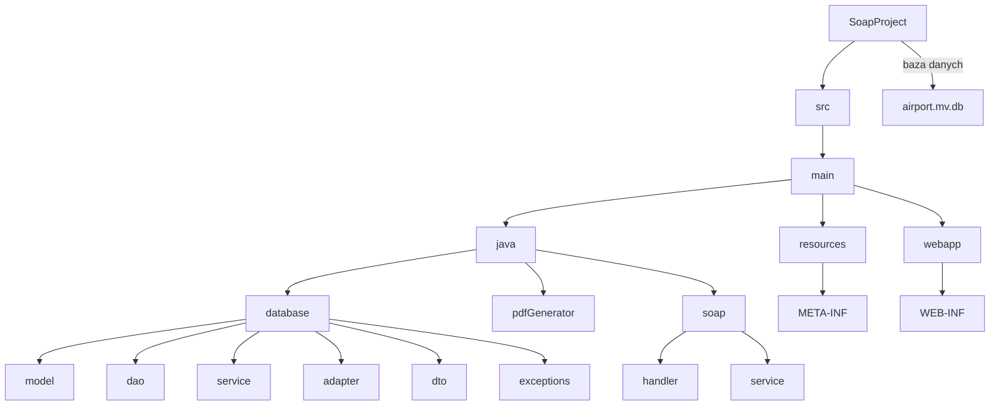

___
**Zalecane wersje Java 8, Payara 5.2022.5, SoapUi-4.6.4, baza danych H2 1.4.200, IDE Inteliji Ultimate**
___

## Zawartość REDME
1. :airplane: [Funkcjonalność](#funkcjonalność)
2. :computer: [Działanie serwera](#działanie-serwera)
3. 📦 [Instalacja](#instrukcja-instalacji)
4. :wrench: [Konfiguracja serwera](#instrukcja-konfiguracji-serwera)
5. :satellite: [Modyfikowanie bazy danych](#użycie-konsoli-inteliji-do-modyfikowania-bazy-danych)
6. :eyes: [Monitorowanie requestów](#instrukcja-monitorowania-requestów)
7. :dragon: [Konfiguracja klienta w pythonie](#instrukcja-konfiguracji-klienta)
8. :file_folder: [Struktura projektu](#struktura-projektu)
9. :white_check_mark: [Wskazówki](#wskazówki-użycia)

# Funkcjonalność
**System rezerwacji biletów lotniczych**
1) [x] Baza lotów (Miasto od , Miasto do, dzień, godzina)
2) [x] Wyszukiwanie lotów
3) [x] Kupno biletu
4) [x] Odbiór potwierdzenia kupna w formacie PDF
5) [x] Sprawdzenie rezerwacji na podstawie podanego numeru

# Działanie Serwera
Można sprawdzić działanie serwera w:  
- http://localhost:8080/SoapProject/AirportServerImplService

WSDL:  
- http://localhost:8080/SoapProject/AirportServerImplService?WSDL

Tester Glassfisha:  
- http://localhost:8080/SoapProject/AirportServerImplService?Tester

# Instrukcja instalacji
Linki do pobrania Payary 5.2022.5 i H2 1.4.200
- Serwer Payara 5.2022.5: [Payara 5.2022.5](https://nexus.payara.fish/#browse/browse:payara-community:fish%2Fpayara%2Fdistributions%2Fpayara%2F5.2022.5%2Fpayara-5.2022.5.zip)
- Baza danych H2 1.4.200: [H2 1.4.200](https://www.h2database.com/html/download-archive.html)

<h3><details>
    <summary>Dodanie Payary do Inteliji:</summary>
        Edit configurations... -> + -> Glassfish server Local -> Configure          
        
</details></h3>

<h3><details>
    <summary>Wymagane pluginy w Inteliji <b>GlassFish</b>, <b>Maven</b> i <b>Maven Extension</b>: </summary>      
        File -> Settings -> Plugins          
        
</details></h3>

# Instrukcja konfiguracji serwera
> [!Important]
> ### Ustawiamy ścieżke do naszej bazy danych w:
> [SoapProject/src/main/java/database/Configuration.java](https://github.com/rzymski/SoapProject/blob/master/SoapProject/src/main/java/database/Configuration.java) ${\textsf{\color{gold}@DataSourceDefinition}}$ **`url`**

<details>
  <summary>Kod <b><code>@DataSourceDefinition</code></b> zawierający <b>url</b> do bazy danych</summary>

  ```java
  @DataSourceDefinition(
        name = "java:global/SoapProjectDataSource",
        className = "org.h2.jdbcx.JdbcDataSource",
        url = "jdbc:h2:file:yourPath/SoapProject/SoapProject/airport",
        minPoolSize = 1,
        initialPoolSize = 1,
        user = "sa",
        password = ""
    )
  @FacesConfig
  @Singleton
  @Startup
  public class Configuration {
  ```
</details>

> [!Note]
> ### Ustawiamy ścieżke do obrazka, który ma być w pdf-ie w:
> [SoapProject/src/main/java/soap/service/AirportServerImpl.java](https://github.com/rzymski/SoapProject/blob/master/SoapProject/src/main/java/soap/service/AirportServerImpl.java) ${\textsf{\color{red}generatePdf(Long reservationId)}}$ **`imagePath`** 

<details>
  <summary>Kod <b><code>generatePdf</code></b> zawierający <b>url</b> do pliku obrazka</summary>

  ```java
@Override
public byte[] generatePdf(Long reservationId) throws IOException {
    FlightReservationDTO res = checkFlightReservation(reservationId);
    if (res == null) {
        throw new RecordNotFoundException("No reservation with ID: " + reservationId);
    }
    ByteArrayOutputStream byteArrayOutputStream = new ByteArrayOutputStream();
    PdfGenerator pdfGenerator = new PdfGenerator(byteArrayOutputStream, res);
    pdfGenerator.setHeaderFooter("Potwierdzenie rezerwacji biletu", "Super linie lotnicze sp. z o.o.");
    String imagePath = "youPath\\SoapProject\\screens\\plane.png";
    pdfGenerator.setImage(imagePath);
    pdfGenerator.generate();
    return byteArrayOutputStream.toByteArray();
}
  ```
</details>

<h3><details>
    <summary>Ustawienie Javy 8</summary>
        File -> Project Structure...:
        
</details></h3>

<h3><details>
    <summary>Maven Lifecycle wyczyszczenie i zbudowanie projektu:</summary>
        View -> Tool Windows -> Maven -> SoapProject -> Lifecycle i klikamy <b>clean</b>, a następnie <b>package</b>
        
</details></h3>

<h3><details>
    <summary>Konfiguracja Payary: </summary>
        
        
        
</details></h3>

<h3><details>
    <summary>Ustawienie/sprawdzenie połączenia z bazą danych przez Inteliji: </summary>
        View -> Tool Windows -> Database -> + -> Data Source -> H2
        
</details></h3>

# Użycie konsoli Inteliji do modyfikowania bazy danych
#### Uruchomienie konsoli Inteliji
View -> Tool Windows -> Database -> wybieramy naszą baze danych np. airport -> QL -> Open Default Console

#### Tworzenie lotów w bazie za pomocą CSV:
```sh
INSERT INTO Flight (ID, FLIGHTCODE, DEPARTUREAIRPORT, DEPARTURETIME, DESTINATIONAIRPORT, ARRIVALTIME, CREATEDATE, UPDATEDATE, CAPACITY, OCCUPIEDSEATS)          
SELECT *
FROM CSVREAD('D:/programowanie/java/rsi/SoapProject/createDatabaseCSV/flights.csv', null);
```

# Instrukcja monitorowania requestów


<h3><details>
    <summary>Ustawienie <b><code>SoapUi HTTP Proxy</code></b> na porcie <b>8085</b>:</summary>
        
</details></h3>

<h3><details>
    <summary>Przykładowe działanie <b><code>SoapUi HTTP Proxy</code></b> na porcie <b>8085</b>:</summary>
        
</details></h3>

<h3><details>
    <summary>Ustawienie <b><code>tcpMonitor</code></b> na porcie <b>8084</b>:</summary>
        
</details></h3>

<h3><details>
    <summary>Przykładowe działanie <b><code>tcpMonitor</code></b> na porcie <b>8084</b>:</summary>
        
</details></h3>      

# Instrukcja konfiguracji klienta
Przechodzimy w konsoli do folderu **`pythonClient`**

Tworzymy wirtualne środowisko
```sh
python -m venv venv
```

Aktywujemy wirtualne środowisko
```sh
.\venv\Scripts\activate
```
Instalujemy wszystkie potrzebne biblioteki z pliku `requirements.txt`
```sh
pip install -r .\requirements.txt
```

# Struktura projektu
### Ogólna struktura całego projektu
```
.
├───createDatabaseCSV
│   └───pythonScriptToCreateCSV
├───pdfs
├───pythonClient
├───screens
├───SoapProject
│   └───src
│       └───main
│           ├───java
│           │   ├───database
│           │   │   ├───adapter
│           │   │   ├───dao
│           │   │   ├───dto
│           │   │   ├───exceptions
│           │   │   ├───model
│           │   │   └───service
│           │   ├───pdfGenerator
│           │   └───soap
│           │       ├───handler
│           │       └───service
│           ├───resources
│           │   └───META-INF
│           └───webapp
│               └───WEB-INF
└───tcpMonitor
```

### Struktura serwera javy w **`SoapProject`**
<!--- W cmd: tree /F  --->
```
SoapProject
│   airport.mv.db
│   pom.xml
└───src
    └───main
        ├───java
        │   ├───database
        │   │   │   Configuration.java
        │   │   ├───adapter
        │   │   │       LocalDateTimeAdapter.java
        │   │   ├───dao
        │   │   │       AbstractDao.java
        │   │   │       AbstractDaoJpaImpl.java
        │   │   │       FlightDao.java
        │   │   │       FlightDaoImpl.java
        │   │   │       FlightReservationDao.java
        │   │   │       FlightReservationDaoImpl.java
        │   │   │       UserDao.java
        │   │   │       UserDaoImpl.java
        │   │   │       UserGroupDao.java
        │   │   │       UserGroupDaoImpl.java
        │   │   ├───dto
        │   │   │       FlightDTO.java
        │   │   │       FlightReservationDTO.java
        │   │   ├───exceptions
        │   │   │       NotEnoughDataException.java
        │   │   │       RecordNotFoundException.java
        │   │   │       UserNotFoundException.java
        │   │   ├───model
        │   │   │       AbstractModel.java
        │   │   │       Flight.java
        │   │   │       FlightReservation.java
        │   │   │       User.java
        │   │   │       UserGroup.java
        │   │   └───service
        │   │           FlightReservationService.java
        │   │           FlightReservationServiceImpl.java
        │   │           FlightService.java
        │   │           FlightServiceImpl.java
        │   │           UserService.java
        │   │           UserServiceImpl.java
        │   ├───pdfGenerator
        │   │       HeaderFooterEventHandler.java
        │   │       PdfGenerator.java
        │   └───soap
        │       ├───handler
        │       │       LoginHandler.java
        │       └───service
        │               AirportServer.java
        │               AirportServerImpl.java
        ├───resources
        │   │   loginHandler.xml
        │   └───META-INF
        │           persistence.xml
        └───webapp
            │   index.xhtml
            └───WEB-INF
                    web.xml
```




# Wskazówki użycia
> [!Tip]
> <details>
>  <summary>Wskazówki</summary>
>
>  ###
>  01. :white_check_mark: &nbsp; Baza danych nie może być otwarta w tym samym momencie przez aplikacje i konsole Inteliji 
